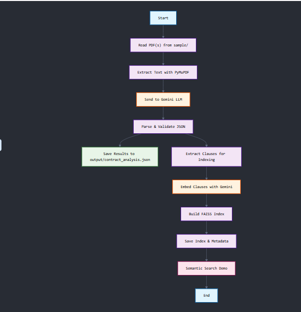

# Contract Analysis LLM Pipeline

## Overview

This project provides an automated pipeline for analyzing legal contract PDFs using Google Gemini LLM and semantic search. It extracts summaries and key clauses (Termination, Confidentiality, Liability/Indemnity) from contracts and enables semantic search over extracted clauses.

---

## Features

- **Single-file and Batch Processing:** Analyze one or all contract PDFs in the `sample/` directory.
- **LLM Extraction:** Uses Google Gemini to extract structured summaries and clauses.
- **Semantic Search:** Builds a FAISS index for fast, natural language search over extracted clauses.
- **Configurable:** Easily switch between single-file and batch mode in `main.py`.

---

## Setup Instructions

### 1. Clone the Repository

```
git clone https://github.com/TSxSAHIL/CUAD-Legal-Contracts.git
```

### 2. Install Dependencies

Create a virtual environment (optional but recommended):

```
python -m venv llm-task
llm-task\Scripts\activate  # On Windows
```

Install required packages:

```
pip install -r requirements.txt
```

### 3. Add Your Google API Key

- Create a `.env` file in the project root.
- Add your Google API key:
  ```
  GOOGLE_API_KEY=your_google_api_key_here
  ```

### 4. Add Contract PDFs

- Place your contract PDF files in the `sample/` directory.

---

## Running the Pipeline

### Batch Mode (All PDFs)

- Run:
  ```
  python main.py
  ```

### Output

- Results are saved to `output/json/contract_analysis.json` (main results) and `output/json/clause_metadata.json` (for semantic search).
- Similarly the csv format is in `output/csv` Folder.

---

## Technology Choices

### Why Google Gemini LLM?

- **Long Context Window:** Gemini supports a much larger context window than most open-source LLMs, allowing the entire contract (even lengthy legal documents) to be analyzed in a single prompt. This enables more accurate extraction of summaries and clauses, as the model can "see" the whole document at once.
- **High-Quality Legal Reasoning:** Gemini provides strong performance on legal and structured extraction tasks, especially when used with few-shot prompting.

### Why FAISS for Semantic Search?

- **Efficient Similarity Search:** FAISS is a state-of-the-art library for fast similarity search and clustering of dense vectors. It enables real-time, scalable semantic search over thousands of extracted contract clauses.
- **Scalability:** FAISS can handle large numbers of embeddings efficiently, making it suitable for legal document repositories that may grow over time.

---

## Solution Approach & Flow Diagram

### Approach

1. **PDF Extraction:**
   - Extracts and normalizes text from each PDF using PyMuPDF.
2. **LLM Analysis:**
   - Sends the contract text to Gemini LLM with a few-shot prompt.
   - Parses and validates the JSON response using Pydantic.
3. **Result Aggregation:**
   - Collects summaries and key clauses for each contract.
   - Saves results to JSON.
4. **Semantic Indexing:**
   - Embeds extracted clauses using Gemini embeddings.
   - Builds a FAISS index for semantic search.
5. **Semantic Search Demo:**
   - Demonstrates search for common legal queries.

### Flow Diagram



## Notes

- The pipeline is modular and can be extended for more clause types or different LLMs.
- For large-scale or production use, consider batching API calls and handling rate limits.

